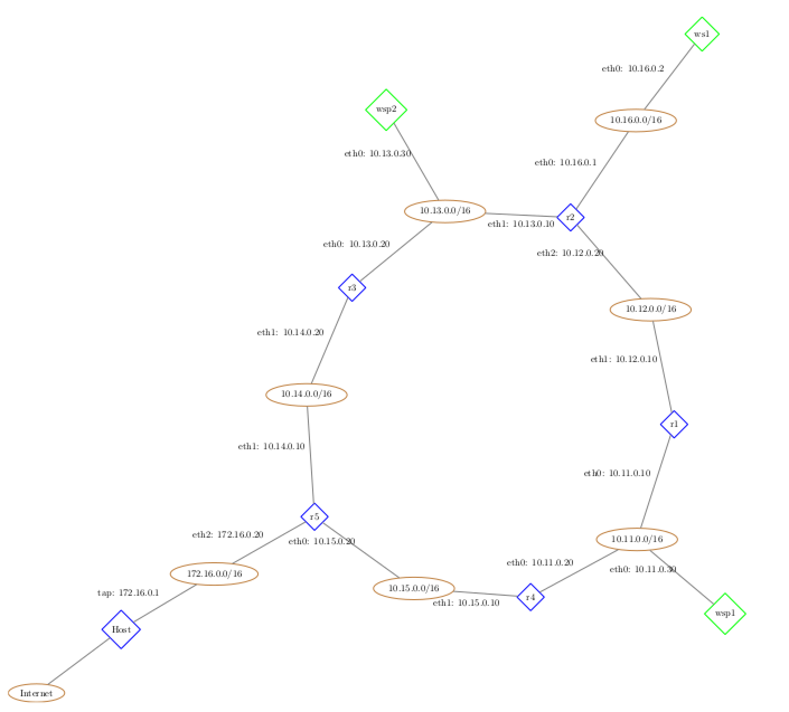

Лабораторная работа 2. 
Динамическая маршрутизация. Протокол RIP
==============

## Настройка сети

### Топология сети

Топология сети и используемые IP-адреса:



Перечень узлов, на которых используется динамическая IP-маршрутизация: r1, r2, r3, r4, r5, wsp1, wsp2

### Назначение IP-адресов

Ниже приведён файл сетевой настройки маршрутизатора r1.

	auto lo
	iface lo inet loopback

	auto eth0
	iface eth0 inet static
	address 10.11.0.10
	netmask 255.255.0.0

	auto eth1
	iface eth1 inet static
	address 10.12.0.10
	netmask 255.255.0.0

Ниже приведён файл сетевой настройки рабочей станции ws1.

	auto lo
	iface lo inet loopback

	auto eth0
	iface eth0 inet static
	address 10.16.0.2
	netmask 255.255.0.0
	gateway 10.16.0.1

### Настройка протокола RIP

Ниже приведен файл ```/etc/quagga/ripd.conf``` маршрутизатора r5.

	! Этот настройки, касающиеся протокола RIP.
	router rip

	! Раскомментируйте ниже все интерфейсы, подключённые
	! к сетям с другими маршрутизаторами.
	network eth0
	network eth1
	! network eth2

	! Уменьшаем значения всех таймеров для ускорения опытов.
	! Рассылка: 10 сек., устаревание: 60 cек., сборка мусора: 120 сек.
	timers basic 10 60 120

	! Следующие две строчки заставляют маршрутизатор
	! добавлять в сообщения протокола RIP все известные ему маршруты.
	redistribute kernel
	! redistribute connected

	! Это имя файла журнала службы RIP.
	! Его содержимое можно изучить в случае неполадок
	log file /var/log/quagga/ripd.log


Ниже приведен файл ```/etc/quagga/ripd.conf``` рабочий станции, связанной с несколькими маршрутизаторами wsp1.

	! Этот настройки, касающиеся протокола RIP.
	router rip

	! Раскомментируйте ниже все интерфейсы, подключённые
	! к сетям с другими маршрутизаторами.
	network eth0
	! network eth1
	! network eth2

	! Уменьшаем значения всех таймеров для ускорения опытов.
	! Рассылка: 10 сек., устаревание: 60 cек., сборка мусора: 120 сек.
	timers basic 10 60 120

	! Следующие две строчки заставляют маршрутизатор
	! добавлять в сообщения протокола RIP все известные ему маршруты.
	redistribute kernel
	redistribute connected

	! Это имя файла журнала службы RIP.
	! Его содержимое можно изучить в случае неполадок
	log file /var/log/quagga/ripd.log


### Проверка настройки протокола RIP

Вывод **traceroute** от узла wsp1 до wsp2 при нормальной работе сети.

	wsp1:~# traceroute -n 10.13.0.30
	traceroute to 10.13.0.30 (10.13.0.30), 64 hops max, 40 byte packets
	1  10.11.0.10  1 ms  0 ms  0 ms
	2  10.12.0.20  2 ms  0 ms  0 ms
	3  10.13.0.30  15 ms  0 ms  0 ms

Вывод **traceroute** от узла ws1 до внешнего IP.

	ws1:~# traceroute -n 188.166.161.195
	traceroute to 188.166.161.195 (188.166.161.195), 64 hops max, 40 byte packets
	1  10.16.0.1  0 ms  0 ms  0 ms
	2  10.13.0.20  8 ms  0 ms  0 ms
	3  10.14.0.10  15 ms  0 ms  0 ms
	4  172.16.0.1  1 ms  1 ms  1 ms
	5  * * *

Вывод сообщения RIP:

	r1:~#  tcpdump -tnv -i eth0 -s 1518 udp
	tcpdump: listening on eth0, link-type EN10MB (Ethernet), capture size 1518 bytes
	IP (tos 0x0, ttl 1, id 0, offset 0, flags [DF], proto UDP (17), length 112) 10.11.0.20.520 > 224.0.0.9.520: 
		RIPv2, Response, length: 84, routes: 4
		AFI: IPv4:         0.0.0.0/0 , tag 0x0000, metric: 2, next-hop: self
		AFI: IPv4:       10.13.0.0/16, tag 0x0000, metric: 3, next-hop: self
		AFI: IPv4:       10.14.0.0/16, tag 0x0000, metric: 2, next-hop: self
		AFI: IPv4:       10.15.0.0/16, tag 0x0000, metric: 1, next-hop: self

Вывод таблицы RIP:

	r1# show ip rip
	Codes: R - RIP, C - connected, S - Static, O - OSPF, B - BGP
	Sub-codes:
		(n) - normal, (s) - static, (d) - default, (r) - redistribute,
		(i) - interface

		Network            Next Hop         Metric From            Tag Time
	R(n) 0.0.0.0/0          10.11.0.20            3 10.11.0.20        0 00:54
	C(i) 10.11.0.0/16       0.0.0.0               1 self              0
	C(i) 10.12.0.0/16       0.0.0.0               1 self              0
	R(n) 10.13.0.0/16       10.12.0.20            2 10.12.0.20        0 00:56
	R(n) 10.14.0.0/16       10.11.0.20            3 10.11.0.20        0 00:54
	R(n) 10.15.0.0/16       10.11.0.20            2 10.11.0.20        0 00:54
	R(n) 10.16.0.0/16       10.12.0.20            2 10.12.0.20        0 00:56

Вывод таблицы маршрутизации:

	r1:~# ip r
	10.16.0.0/16 via 10.12.0.20 dev eth1  proto zebra  metric 2 
	10.11.0.0/16 dev eth0  proto kernel  scope link  src 10.11.0.10 
	10.14.0.0/16 via 10.11.0.20 dev eth0  proto zebra  metric 3 
	10.15.0.0/16 via 10.11.0.20 dev eth0  proto zebra  metric 2 
	10.12.0.0/16 dev eth1  proto kernel  scope link  src 10.12.0.10 
	10.13.0.0/16 via 10.12.0.20 dev eth1  proto zebra  metric 2 
	default via 10.11.0.20 dev eth0  proto zebra  metric 3

## Расщепленный горизонт и испорченные обратные обновления

Вывод RIPv2 сообщения маршрутизатора r3 с включенным расщепленным горизонтом:

	tcpdump: listening on eth0, link-type EN10MB (Ethernet), capture size 1518 bytes
	IP (tos 0x0, ttl 1, id 0, offset 0, flags [DF], proto UDP (17), length 112) 10.13.0.20.520 > 224.0.0.9.520: 
		RIPv2, Response, length: 84, routes: 4
		AFI: IPv4:         0.0.0.0/0 , tag 0x0000, metric: 2, next-hop: self
		AFI: IPv4:       10.11.0.0/16, tag 0x0000, metric: 3, next-hop: self
		AFI: IPv4:       10.14.0.0/16, tag 0x0000, metric: 1, next-hop: self
		AFI: IPv4:       10.15.0.0/16, tag 0x0000, metric: 2, next-hop: self

Как можно заметить, при рассылке с учётом правила расщепленного горизонта, данные таблицы RIP для подсетей 10.13.0.0/16, 10.12.0.0/16, 10.16.0.0/16 не отправляются с интерфейса eth0, так как информация об этих маршрутах была получена с данного интерфейса. 


Вывод RIPv2 сообщения маршрутизатора r3 с включенным испорченными обновлениями:

	IP (tos 0x0, ttl 1, id 0, offset 0, flags [DF], proto UDP (17), length 172) 10.13.0.20.520 > 224.0.0.9.520: 
		RIPv2, Response, length: 144, routes: 7
		AFI: IPv4:         0.0.0.0/0 , tag 0x0000, metric: 2, next-hop: self
		AFI: IPv4:       10.11.0.0/16, tag 0x0000, metric: 3, next-hop: self
		AFI: IPv4:       10.12.0.0/16, tag 0x0000, metric: 16, next-hop: 10.13.0.10
		AFI: IPv4:       10.13.0.0/16, tag 0x0000, metric: 16, next-hop: self
		AFI: IPv4:       10.14.0.0/16, tag 0x0000, metric: 1, next-hop: self
		AFI: IPv4:       10.15.0.0/16, tag 0x0000, metric: 2, next-hop: self
		AFI: IPv4:       10.16.0.0/16, tag 0x0000, metric: 16, next-hop: 10.13.0.10

При использовании правила испорченного обратно обновления, информация о таких маршрутах включается в сообщение, но метрика таких маршрутов равна 16 (бесконечности).


Вывод RIPv2 сообщения маршрутизатора r3 с отключенным расщепленным горизонтом:

	IP (tos 0x0, ttl 1, id 0, offset 0, flags [DF], proto UDP (17), length 172) 10.13.0.20.520 > 224.0.0.9.520: 
		RIPv2, Response, length: 144, routes: 7
		AFI: IPv4:         0.0.0.0/0 , tag 0x0000, metric: 2, next-hop: self
		AFI: IPv4:       10.11.0.0/16, tag 0x0000, metric: 3, next-hop: 10.13.0.10
		AFI: IPv4:       10.12.0.0/16, tag 0x0000, metric: 2, next-hop: 10.13.0.10
		AFI: IPv4:       10.13.0.0/16, tag 0x0000, metric: 1, next-hop: self
		AFI: IPv4:       10.14.0.0/16, tag 0x0000, metric: 1, next-hop: self
		AFI: IPv4:       10.15.0.0/16, tag 0x0000, metric: 2, next-hop: self
		AFI: IPv4:       10.16.0.0/16, tag 0x0000, metric: 2, next-hop: 10.13.0.10

При отключении правила, метрика описанных выше маршрутов устанавливается в реальное значение, хранимое в таблице RIP, однако учитываться маршрутизатором-получателем данные метрики будут навряд ли, так как значение новой полученной метрики из сообщения должно быть больше на единицу, чем у получателя.

Вернём настройки в исходное состояние (включенный без испорченных).

## Имитация устранимой поломки в сети

Вывод **traceroute** от узла такого-то до такого-то после того, как служба RIP перестроила таблицы маршрутизации.

	ws1:~# traceroute -n 10.11.0.30
	traceroute to 10.11.0.30 (10.11.0.30), 64 hops max, 40 byte packets
	1  10.16.0.1  0 ms  0 ms  0 ms
	2  10.12.0.10  11 ms  0 ms  0 ms
	3  10.11.0.30  10 ms  0 ms  0 ms

Отключим маршрутизатор r1 для наблюдения за поведением маршрутизаторов при устранимой поломке в сети.


Вывод таблицы RIP непосредственно перед истечением таймера устаревания (на маршрутизаторе-соседе отключенного):

	r4# show ip rip
	Codes: R - RIP, C - connected, S - Static, O - OSPF, B - BGP
	Sub-codes:
		(n) - normal, (s) - static, (d) - default, (r) - redistribute,
		(i) - interface

		Network            Next Hop         Metric From            Tag Time
	R(n) 0.0.0.0/0          10.15.0.20            2 10.15.0.20        0 00:55
	C(i) 10.11.0.0/16       0.0.0.0               1 self              0
	R(n) 10.12.0.0/16       10.11.0.10            2 10.11.0.10        0 00:12
	R(n) 10.13.0.0/16       10.11.0.10            3 10.11.0.10        0 00:12
	R(n) 10.14.0.0/16       10.15.0.20            2 10.15.0.20        0 00:55
	C(i) 10.15.0.0/16       0.0.0.0               1 self              0
	R(n) 10.16.0.0/16       10.11.0.10            3 10.11.0.10        0 00:12

Перестроенная таблица на этом же маршрутизаторе:

	r4# show ip rip
	Codes: R - RIP, C - connected, S - Static, O - OSPF, B - BGP
	Sub-codes:
		(n) - normal, (s) - static, (d) - default, (r) - redistribute,
		(i) - interface

		Network            Next Hop         Metric From            Tag Time
	R(n) 0.0.0.0/0          10.15.0.20            2 10.15.0.20        0 00:57
	C(i) 10.11.0.0/16       0.0.0.0               1 self              0
	R(n) 10.12.0.0/16       10.11.0.10           16 10.11.0.10        0 01:55
	R(n) 10.13.0.0/16       10.15.0.20            3 10.15.0.20        0 00:57
	R(n) 10.14.0.0/16       10.15.0.20            2 10.15.0.20        0 00:57
	C(i) 10.15.0.0/16       0.0.0.0               1 self              0
	R(n) 10.16.0.0/16       10.15.0.20            4 10.15.0.20        0 00:57


Вывод **traceroute** от узла такого-то до такого-то после того, как служба RIP перестроила таблицы маршрутизации:

	ws1:~# traceroute -n 10.11.0.30
	traceroute to 10.11.0.30 (10.11.0.30), 64 hops max, 40 byte packets
	1  10.16.0.1  1 ms  1 ms  0 ms
	2  10.13.0.20  11 ms  0 ms  0 ms
	3  10.14.0.10  11 ms  1 ms  0 ms
	4  10.15.0.10  6 ms  0 ms  0 ms
	5  10.11.0.30  11 ms  0 ms  0 ms

## Имитация неустранимой поломки в сети

Отключим маршрутизатор r3, чтобы сеть перестала быть связанной.
Ниже приведены таблицы маршрутизации RIP маршрутизатора r5 после отключения маршрутизатора r3.

	r5# show ip rip
	Codes: R - RIP, C - connected, S - Static, O - OSPF, B - BGP
	Sub-codes:
		(n) - normal, (s) - static, (d) - default, (r) - redistribute,
		(i) - interface

		Network            Next Hop         Metric From            Tag Time
	K(r) 0.0.0.0/0          172.16.0.1            1 self              0
	R(n) 10.11.0.0/16       10.15.0.10            2 10.15.0.10        0 00:57
	R(n) 10.12.0.0/16       10.14.0.20            3 10.14.0.20        0 00:01
	R(n) 10.13.0.0/16       10.14.0.20            2 10.14.0.20        0 00:01
	C(i) 10.14.0.0/16       0.0.0.0               1 self              0
	C(i) 10.15.0.0/16       0.0.0.0               1 self              0
	R(n) 10.16.0.0/16       10.14.0.20            3 10.14.0.20        0 00:01

	r5# show ip rip
	Codes: R - RIP, C - connected, S - Static, O - OSPF, B - BGP
	Sub-codes:
		(n) - normal, (s) - static, (d) - default, (r) - redistribute,
		(i) - interface

		Network            Next Hop         Metric From            Tag Time
	K(r) 0.0.0.0/0          172.16.0.1            1 self              0
	R(n) 10.11.0.0/16       10.15.0.10            2 10.15.0.10        0 00:54
	R(n) 10.12.0.0/16       10.14.0.20           16 10.14.0.20        0 01:58
	R(n) 10.13.0.0/16       10.14.0.20           16 10.14.0.20        0 01:58
	C(i) 10.14.0.0/16       0.0.0.0               1 self              0
	C(i) 10.15.0.0/16       0.0.0.0               1 self              0
	R(n) 10.16.0.0/16       10.14.0.20           16 10.14.0.20        0 01:58

Отправка маршрутизатором r5 сообщений RIP с метрикой 16:

	r5:~# tcpdump -tnv -i eth0 -s 1518 udp
	tcpdump: listening on eth0, link-type EN10MB (Ethernet), capture size 1518 bytes
	IP (tos 0x0, ttl 1, id 0, offset 0, flags [DF], proto UDP (17), length 132) 10.15.0.20.520 > 224.0.0.9.520: 
		RIPv2, Response, length: 104, routes: 5
		AFI: IPv4:         0.0.0.0/0 , tag 0x0000, metric: 1, next-hop: self
		AFI: IPv4:       10.12.0.0/16, tag 0x0000, metric: 16, next-hop: self
		AFI: IPv4:       10.13.0.0/16, tag 0x0000, metric: 16, next-hop: self
		AFI: IPv4:       10.14.0.0/16, tag 0x0000, metric: 1, next-hop: self
		AFI: IPv4:       10.16.0.0/16, tag 0x0000, metric: 16, next-hop: self
