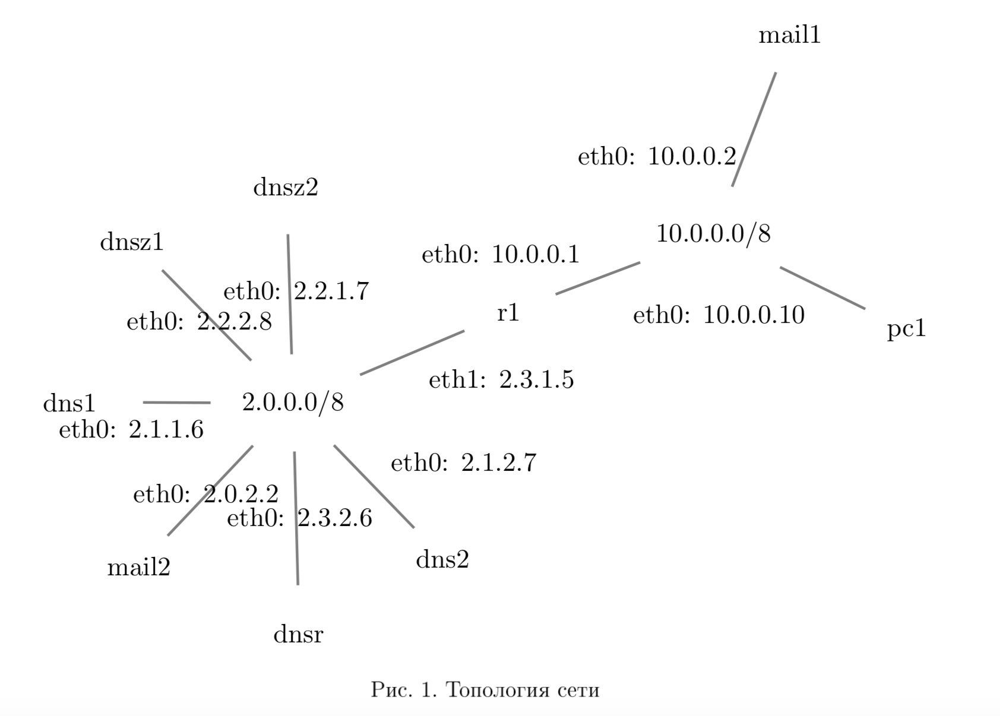
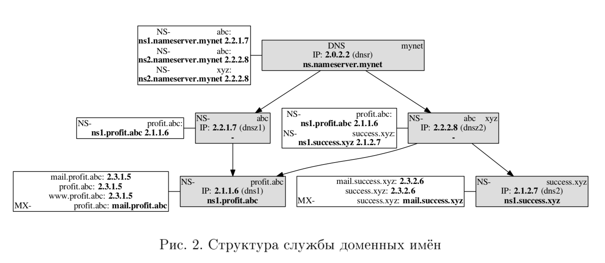

Лабораторная работа 5. 
Служба доменных имен DNS
==============

## Настройка системы DNS

### Топология сети

Топология сети и использыемые IP-адреса показаны на рис.1.

### Структура службы доменных имён

Структура авторитетных серверов доменных имён показана на рис.2.

## Проверка настройки службы доменных имён

### Проверка настройки записи типа MX для домена profit.abc

По цепочке опрашиваем с корневого сервера:

    mail2:~# dig @2.0.2.2 profit.abc MX

    ; <<>> DiG 9.5.0-P2 <<>> @2.0.2.2 profit.abc MX
    ; (1 server found)
    ;; global options:  printcmd
    ;; Got answer:
    ;; ->>HEADER<<- opcode: QUERY, status: NOERROR, id: 25690
    ;; flags: qr rd; QUERY: 1, ANSWER: 0, AUTHORITY: 2, ADDITIONAL: 2
    ;; WARNING: recursion requested but not available

    ;; QUESTION SECTION:
    ;profit.abc.			IN	MX

    ;; AUTHORITY SECTION:
    abc.			86400	IN	NS	ns1.nameserver.mynet.
    abc.			86400	IN	NS	ns2.nameserver.mynet.

    ;; ADDITIONAL SECTION:
    ns1.nameserver.mynet.	86400	IN	A	2.2.1.7
    ns2.nameserver.mynet.	86400	IN	A	2.2.2.8

    ;; Query time: 3 msec
    ;; SERVER: 2.0.2.2#53(2.0.2.2)
    ;; WHEN: Sat Dec 15 03:22:59 2018
    ;; MSG SIZE  rcvd: 112

Опрашиваем следующий сервер abc. по одному из полученных адресов (2.2.1.7):

    mail2:~# dig @2.2.1.7 profit.abc MX

    ; <<>> DiG 9.5.0-P2 <<>> @2.2.1.7 profit.abc MX
    ; (1 server found)
    ;; global options:  printcmd
    ;; Got answer:
    ;; ->>HEADER<<- opcode: QUERY, status: NOERROR, id: 44926
    ;; flags: qr rd; QUERY: 1, ANSWER: 0, AUTHORITY: 1, ADDITIONAL: 1
    ;; WARNING: recursion requested but not available

    ;; QUESTION SECTION:
    ;profit.abc.			IN	MX

    ;; AUTHORITY SECTION:
    profit.abc.		86400	IN	NS	ns1.profit.abc.

    ;; ADDITIONAL SECTION:
    ns1.profit.abc.		86400	IN	A	2.1.1.6

    ;; Query time: 5 msec
    ;; SERVER: 2.2.1.7#53(2.2.1.7)
    ;; WHEN: Sat Dec 15 03:24:05 2018
    ;; MSG SIZE  rcvd: 62

Опрашиваем следующий NS-сервер profit.abc. с адресом 2.1.1.6:

    mail2:~# dig @2.1.1.6 profit.abc MX

    ; <<>> DiG 9.5.0-P2 <<>> @2.1.1.6 profit.abc MX
    ; (1 server found)
    ;; global options:  printcmd
    ;; Got answer:
    ;; ->>HEADER<<- opcode: QUERY, status: NOERROR, id: 59319
    ;; flags: qr aa rd; QUERY: 1, ANSWER: 1, AUTHORITY: 1, ADDITIONAL: 2
    ;; WARNING: recursion requested but not available

    ;; QUESTION SECTION:
    ;profit.abc.			IN	MX

    ;; ANSWER SECTION:
    profit.abc.		86400	IN	MX	10 mail.profit.abc.

    ;; AUTHORITY SECTION:
    profit.abc.		86400	IN	NS	ns1.profit.abc.

    ;; ADDITIONAL SECTION:
    mail.profit.abc.	86400	IN	A	2.3.1.5
    ns1.profit.abc.		86400	IN	A	2.1.1.6

    ;; Query time: 8 msec
    ;; SERVER: 2.1.1.6#53(2.1.1.6)
    ;; WHEN: Sat Dec 15 03:24:50 2018
    ;; MSG SIZE  rcvd: 99

Итоговая проверка - опрашиваем кеширующий DNS-сервер с помощью DIG:

    pc1:~# dig @10.0.0.1 profit.abc MX

    ; <<>> DiG 9.5.0-P2 <<>> @10.0.0.1 profit.abc MX
    ; (1 server found)
    ;; global options:  printcmd
    ;; Got answer:
    ;; ->>HEADER<<- opcode: QUERY, status: NOERROR, id: 32294
    ;; flags: qr rd ra; QUERY: 1, ANSWER: 1, AUTHORITY: 0, ADDITIONAL: 1

    ;; QUESTION SECTION:
    ;profit.abc.			IN	MX

    ;; ANSWER SECTION:
    profit.abc.		86390	IN	MX	10 mail.profit.abc.

    ;; ADDITIONAL SECTION:
    mail.profit.abc.	86390	IN	A	2.3.1.5

    ;; Query time: 4 msec
    ;; SERVER: 10.0.0.1#53(10.0.0.1)
    ;; WHEN: Sat Dec 15 03:33:05 2018
    ;; MSG SIZE  rcvd: 65

Итоговая проверка - проверяем работу DNS с помощью ping:

    pc1:~# ping profit.abc
    PING profit.abc (2.3.1.5) 56(84) bytes of data.
    64 bytes from 2.3.1.5: icmp_seq=1 ttl=64 time=0.175 ms
    64 bytes from 2.3.1.5: icmp_seq=2 ttl=64 time=0.509 ms
    ^C
    --- profit.abc ping statistics ---
    2 packets transmitted, 2 received, 0% packet loss, time 1014ms
    rtt min/avg/max/mdev = 0.175/0.342/0.509/0.167 ms

### Проверка настройки записи типа A для домена success.xyz

По цепочке опрашиваем с корневого сервера:

    mail2:~# dig @2.0.2.2 success.xyz A

    ; <<>> DiG 9.5.0-P2 <<>> @2.0.2.2 success.xyz A
    ; (1 server found)
    ;; global options:  printcmd
    ;; Got answer:
    ;; ->>HEADER<<- opcode: QUERY, status: NOERROR, id: 2901
    ;; flags: qr rd; QUERY: 1, ANSWER: 0, AUTHORITY: 1, ADDITIONAL: 1
    ;; WARNING: recursion requested but not available

    ;; QUESTION SECTION:
    ;success.xyz.			IN	A

    ;; AUTHORITY SECTION:
    xyz.			86400	IN	NS	ns2.nameserver.mynet.

    ;; ADDITIONAL SECTION:
    ns2.nameserver.mynet.	86400	IN	A	2.2.2.8

    ;; Query time: 3 msec
    ;; SERVER: 2.0.2.2#53(2.0.2.2)
    ;; WHEN: Sat Dec 15 03:37:02 2018
    ;; MSG SIZE  rcvd: 79

Опрашиваем следующий сервер xyz. по одному из полученных адресов (2.2.2.8):

    mail2:~# dig @2.2.2.8 success.xyz A

    ; <<>> DiG 9.5.0-P2 <<>> @2.2.2.8 success.xyz A
    ; (1 server found)
    ;; global options:  printcmd
    ;; Got answer:
    ;; ->>HEADER<<- opcode: QUERY, status: NOERROR, id: 62523
    ;; flags: qr rd; QUERY: 1, ANSWER: 0, AUTHORITY: 1, ADDITIONAL: 1
    ;; WARNING: recursion requested but not available

    ;; QUESTION SECTION:
    ;success.xyz.			IN	A

    ;; AUTHORITY SECTION:
    success.xyz.		86400	IN	NS	ns1.success.xyz.

    ;; ADDITIONAL SECTION:
    ns1.success.xyz.	86400	IN	A	2.1.2.7

    ;; Query time: 20 msec
    ;; SERVER: 2.2.2.8#53(2.2.2.8)
    ;; WHEN: Sat Dec 15 03:38:02 2018
    ;; MSG SIZE  rcvd: 63

Опрашиваем следующий NS-сервер success.xyz. с адресом 2.1.2.7:

    mail2:~# dig @2.1.2.7 success.xyz A

    ; <<>> DiG 9.5.0-P2 <<>> @2.1.2.7 success.xyz A
    ; (1 server found)
    ;; global options:  printcmd
    ;; Got answer:
    ;; ->>HEADER<<- opcode: QUERY, status: NOERROR, id: 41331
    ;; flags: qr aa rd; QUERY: 1, ANSWER: 1, AUTHORITY: 1, ADDITIONAL: 1
    ;; WARNING: recursion requested but not available

    ;; QUESTION SECTION:
    ;success.xyz.			IN	A

    ;; ANSWER SECTION:
    success.xyz.		86400	IN	A	2.3.2.6

    ;; AUTHORITY SECTION:
    success.xyz.		86400	IN	NS	ns1.success.xyz.

    ;; ADDITIONAL SECTION:
    ns1.success.xyz.	86400	IN	A	2.1.2.7

    ;; Query time: 5 msec
    ;; SERVER: 2.1.2.7#53(2.1.2.7)
    ;; WHEN: Sat Dec 15 03:40:04 2018
    ;; MSG SIZE  rcvd: 79

    mail2:~# A
